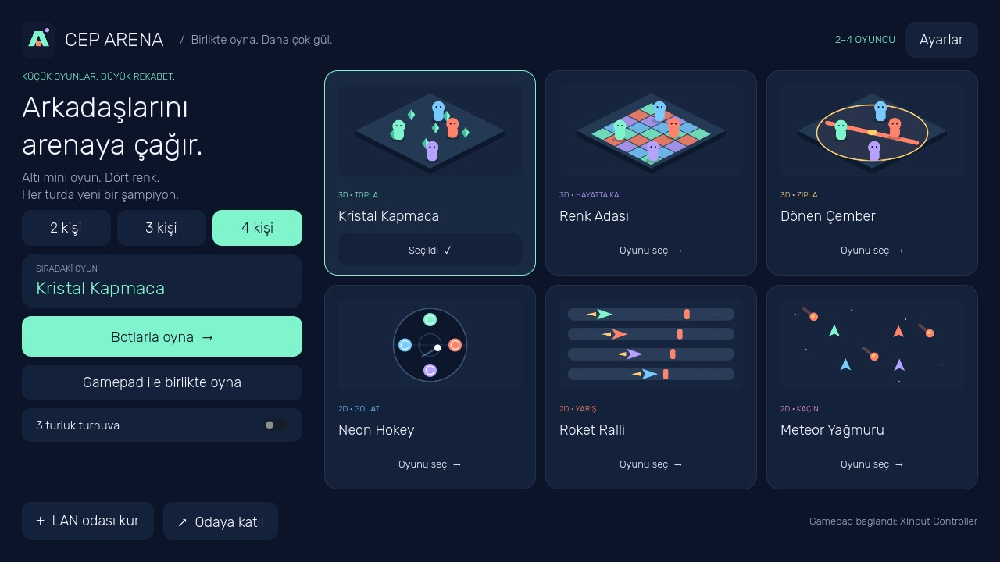

# Cep Arena

Android ve Windows için Türkçe, 2–4 oyunculu bir mini oyun uygulaması. Godot 4.7.2 ile geliştirilmiştir.

**[Oyunu indir](https://ukkase8134.github.io/cep-arena/)** · **[Sürümler](https://github.com/ukkase8134/cep-arena/releases)**

## Oyunlar

| Oyun | Görünüm | Amaç |
|---|---|---|
| Kristal Kapmaca | 3D | Kristal topla, hamle ile hızlan |
| Renk Adası | 3D | Güvenli renkli karoya yetiş |
| Dönen Çember | 3D | Dönen ışından zamanında zıpla |
| Neon Hokey | 2D | Kendi kaleni koru, rakibe gol at |
| Roket Ralli | 2D | Engellerden kaç, turbo ile yarış |
| Meteor Yağmuru | 2D | Meteorlardan kaç, kalkan kullan |

Tek maç veya üç farklı oyundan oluşan turnuva. Eksik oyuncuları botlar tamamlar. Botlar rahat, normal ve zorlu seviyelerde oynar. Skorlar eşitse ortak birincilik geçerlidir; turnuva puanları da eşit sıradaki oyuncular için eşit dağıtılır.

## Nasıl oynanır?

**Botlarla:** Oyunu ve 2 / 3 / 4 kişilik oyuncu sayısını seç, Botlarla oyna düğmesine bas.

**LAN — her kişi kendi cihazında:** Aynı Wi-Fi/LAN'a bağlan. PC'ler aynı Radmin VPN ağında da oynayabilir. Bir cihaz LAN odası kur düğmesine basar. Diğerleri Odaya katıl ekranına oda sahibinin Wi-Fi/Radmin IP'sini yazar. Varsayılan port UDP **28742**. Windows'ta oyuna özel ağ güvenlik duvarı izni ver. Telefonlar Wi-Fi/LAN ile katılır; Radmin Android uygulaması gerektirmez. Android ve Windows aynı protokolü kullanır.

**Aynı PC — ayrı kontrolcüler:** Gamepad ile birlikte oyna ekranı her gamepad'i bağımsız seçer. Tek klavye/mouse + iki ayrı gamepad = üç oyuncu. Klavye/mouse en fazla bir oyuncuya atanır. Aynı klavyede dört tuş grubu yoktur.

**Android gamepad:** Sistemden USB/Bluetooth gamepad'i bağla. Aynı cihaz modunda dokunmatik tek oyuncu, bağlı gamepad'ler diğer oyuncular olabilir.

| Giriş | Hareket | Hamle |
|---|---|---|
| Klavye / mouse | WASD veya oklar | Boşluk, Enter veya sağ tık |
| Xbox / Xbox 360 | Sol çubuk / yön tuşları | A veya RB |
| PlayStation / PS4 | Sol çubuk / yön tuşları | × veya R1 |
| Dokunmatik | Sol joystick | Şimşek |

Ayarlar → Gamepad ve titreşim: giriş kaynağı, otomatik / Xbox / PlayStation gösterimi, ölü bölge, titreşim gücü ve test düğmesi. Oyun olayları için iki motorlu rumble kullanılır. Kullanıcı isteğiyle 20 saniyede bir hafif titreşim eklenmiştir; ayarlardan kapatılır. Direksiyon tipi FFB yoktur. Titreşim ve model tanıma, işletim sistemi ve kontrolcü sürücüsüne bağlıdır. Xbox 360 için uygun USB alıcısı / OTG gerekebilir.

## Derleme

1. Python 3 ile `python scripts/fetch_tools.py`. Resmi Godot editörünü ve sadece Windows / Android şablonlarını indirir. ZIP CRC doğrulaması yapılır.
2. OpenJDK ve Android SDK kurulu olmalı. Godot editör ayarlarında Java SDK ve Android SDK yollarını belirt. APK, hazır Godot şablonundan Gradle gerektirmeden çıkarılır.
3. `powershell -NoProfile -ExecutionPolicy Bypass -File scripts/build.ps1`.
4. Çıktılar: `artifacts/CepArena-Windows.exe`, `artifacts/CepArena-Android.apk`, `artifacts/SHA256SUMS.txt`.

İlk derleme `.secrets/cep-arena.keystore` ve `.secrets/signing.json` oluşturur. Bunlar Git'e eklenmez. Gelecek APK güncellemeleri için bu iki dosyayı güvenli şekilde yedekle; aynı imza korunmalıdır. Release anahtarı yalnızca yerel ortamda tutulur, çevrimiçi depoya veya APK içine yazılmaz. Windows EXE, PCK gömülü tek dosyadır; yayıncı sertifikası ile imzalanmamıştır.

## Doğrulama

`python scripts/verify.py --captures` oyun kurallarını, 2/3/4 kişilik maçları, bot seviyelerini, kontrol izolasyonunu ve dört ayrı ENet sürecini sınar. Gerçek GPU ile yedi ekran görüntüsü üretir. Ayrıntılar [QA.md](QA.md).

Windows'ta bağlı bir Xbox 360 tabanlı kontrolcünün tanınması, çubuk/tuş girdileri ve XInput titreşimi doğrulandı. Fiziksel telefon, PS4, aynı anda iki ayrı gamepad ve gerçek Radmin ağı testi henüz yapılmadı. Dört yerel süreç testi dört ayrı PC testi değildir.

## Yapı

- `game/scripts/simulation.gd`: sunucu tarafından hesaplanan oyun kuralları ve botlar.
- `game/scripts/main.gd`: Türkçe arayüz, lobi, LAN, maç akışı, turnuva ve kayıt.
- `game/scripts/controls.gd`: tek klavye/mouse, ayrı cihaz kimlikli gamepad'ler, dokunmatik.
- `game/scripts/arena_3d.gd` / `arena_2d.gd`: oyun görselleri.
- `docs/`: GitHub Pages indirme sitesi. GitHub Releases dosyalarına bağlanır.

GitHub Pages statik sayfa barındırır; canlı oyun sunucusu olarak kullanılmaz. LAN'da oda sahibi, oyun sunucusudur. Tüm girdiler sunucuda sınırlandırılır. İstemciler skor/konum yazamaz. Kopan uzak oyuncu botla değiştirilir, oda sahibi ayrılırsa maç kapanır.

Uygulama reklam veya analitik servisi içermez. Oyuncu adı ve ayarlar cihazda tutulur. Oda sahibine oyuncu adı ve oyun girdileri gönderilir. Oyun çalışırken GitHub hesabı veya GitHub erişim anahtarı gerekmez.

Oyun kaynakları MIT lisanslıdır. Rubik fontu [SIL OFL](game/assets/FONT-LICENSE.txt) lisanslıdır. Godot motoru MIT lisanslıdır; dağıtımda [Godot telif bilgileri](https://godotengine.org/license/) geçerlidir.
